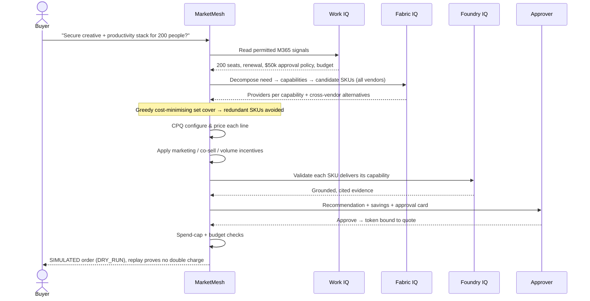
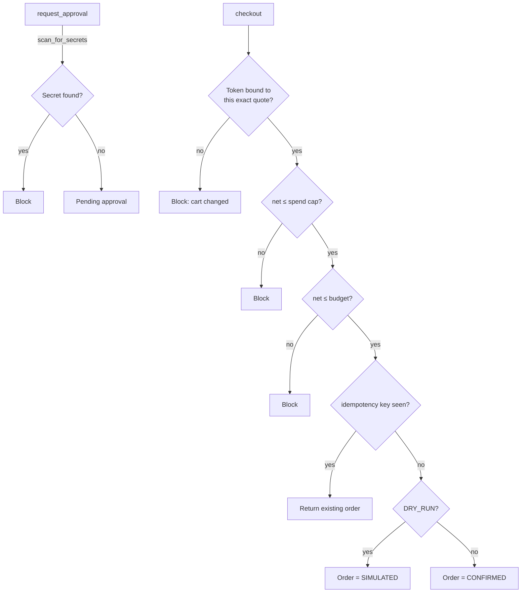

# Architecture — MarketMesh

MarketMesh is a vendor-agnostic, agentic software-commerce brain. It registers any vendor,
makes products searchable + configurable, and reasons across vendors to assemble a cost-
optimised, incentive-aware, human-approved deal — grounded by all three Microsoft IQ
layers. All data is synthetic and checkout runs in `DRY_RUN`.

## Components

| Layer | Responsibility | In this repo |
|---|---|---|
| **Vendor registry** | Dynamic onboarding of any company; vendor-agnostic schema + validation | `vendor_registry.py` |
| **Catalog + search** | Cross-vendor search and capability indexing | `catalog.py`, `search.py` |
| **Fabric IQ** | Product ontology / knowledge graph; capability decomposition; cross-vendor alternatives | `iq/fabric_iq.py` |
| **CPQ configurator** | Validate + price configurations (per-seat / flat / usage / tiered, add-ons) | `configurator.py` |
| **Deal optimizer** | Weighted set-cover, overlap removal, incentives, savings vs baseline | `deal_optimizer.py` |
| **Foundry IQ** | Grounded retrieval over product knowledge (cited) | `iq/foundry_iq.py` |
| **Work IQ** | M365 buyer signals → intent, budget, approver, policy | `iq/work_iq.py` |
| **Guardrails** | Spend cap, budget, secret scan, idempotency | `guardrails.py` |
| **Commerce engine** | Approval token, idempotent DRY_RUN checkout | `commerce.py` |
| **Pipeline / crew** | End-to-end orchestration (single agent or 5-agent crew) | `pipeline.py`, `agents/` |

## Decision sequence

## Guardrail enforcement points

## The optimizer (how the cross-vendor deal is found)

1. **Decompose**: the need is a set of required capabilities (Fabric IQ vocabulary).
2. **Candidates**: for each remaining capability, every SKU that can deliver it (base
   capability *or* via an add-on) across **all** vendors.
3. **Greedy weighted set-cover**: repeatedly pick the SKU maximising
   `newly-covered-capabilities / incremental-annual-cost`. This naturally prefers
   multi-capability bundles and avoids buying two products for the same capability.
4. **Configure & price** each chosen SKU with the CPQ engine.
5. **Incentives**: apply volume / MDF / promo (single-vendor) and **co-sell / bundle**
   (cross-vendor — require partner vendors to be present), capped per vendor for realism.
6. **Savings**: compare to a naive baseline = cheapest single SKU per capability bought
   independently (with overlap), surfacing the value of cross-vendor optimisation.

## Production notes (out of scope for the public scaffold)

- **Auth**: Microsoft Entra ID, OAuth 2.0 + OpenID Connect for the MCP/API action;
  delegated least-privilege Graph scopes for Work IQ; honour Conditional Access.
- **Secrets**: Azure Key Vault; nothing committed; `.env` git-ignored.
- **Hosting**: backend on Azure Container Apps / App Service behind TLS 1.2+.
- **Payments**: swap the synthetic wallet for a payment / agentic-commerce protocol,
  keeping the same human-approval, spend-cap and idempotency gates.
- **Fabric IQ / Foundry IQ**: project the ontology into a Fabric IQ workspace and index
  product knowledge into a Foundry IQ knowledge source; the in-memory views become caches.
