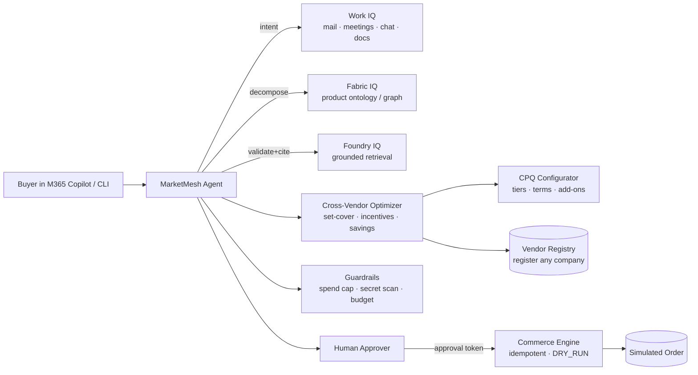

# 🛰️ MarketMesh — Agentic Multi-Vendor Software Commerce

> Register **any** software vendor in seconds, make every product **searchable and
> configurable**, and let an AI agent **assemble the best cross-vendor deal** — cost-
> optimised, incentive-aware, grounded in your real work context, and **human-approved**
> before any (simulated) purchase.

**Agents League @ AI Skills Fest 2026** · Tracks: 🧠 **Reasoning Agents** ·
💼 **Enterprise Agents** · 🎨 **Creative Apps** · Microsoft IQ: **Fabric IQ + Foundry IQ
+ Work IQ** (all three) · License: MIT

> ℹ️ **100% synthetic & public-safe.** Real brand names (Adobe, Cisco, Microsoft) appear
> only as **clearly-labelled illustrative demo data — not official pricing, specifications,
> or endorsement**. One vendor (NovaForge) and the live-registered one (Lumino) are
> fictional. Checkout always runs in `DRY_RUN` — no real payment is ever captured. The repo
> contains no company, customer, tenant, or confidential information of any kind.

---

## 🎯 The problem & the opportunity

Buying software across many vendors is a mess: every vendor has its own catalog, SKUs,
tiers, and incentives; capabilities overlap; and nobody has time to find the *cheapest set
of products that together cover what the business needs*. Distributors and marketplaces
sit on huge value here — if an agent could reason across the whole vendor universe.

**MarketMesh** is that agent. It is **vendor-agnostic**: onboard a brand-new company at
runtime and its products instantly become searchable, configurable, and part of the
optimisation — then the agent solves the hard multi-vendor buying problem for you.

## 💡 What it does

1. **Register any vendor live** — a public brand or a company invented 10 seconds ago.
2. **Search & configure** products across all vendors (CPQ: tiers, terms, seats, add-ons).
3. **Decompose a need into capabilities** and find every candidate SKU (product ontology).
4. **Assemble a cost-optimised covering set** across vendors, minimising redundant SKUs.
5. **Apply marketing / co-sell / volume incentives** — including **cross-vendor co-sell
   advantages** — and show the savings vs a naive one-product-per-capability baseline.
6. **Ground every choice** in retrieved, cited product knowledge.
7. **Route to a human**, then run an **idempotent, simulated checkout**.

---

## 🧠 Microsoft IQ — all three layers

| IQ layer | Role in MarketMesh | Code |
|---|---|---|
| **Fabric IQ** | Semantic **product ontology / knowledge graph** across vendors (Vendor → SKU → Capability → Incentive → cross-vendor alternative). Powers the "cheapest SKUs that together cover capabilities X, Y, Z" reasoning. | [`iq/fabric_iq.py`](src/marketmesh/iq/fabric_iq.py) |
| **Foundry IQ** | Agentic **grounded retrieval** over product knowledge (license terms, datasheets) → cited answers, so the agent never guesses whether a SKU has a capability. | [`iq/foundry_iq.py`](src/marketmesh/iq/foundry_iq.py) |
| **Work IQ** | Permission-enforced **Microsoft 365 buyer signals** — renewals, genuine seat demand, budget owner, approval policy — to ground the deal in real context. | [`iq/work_iq.py`](src/marketmesh/iq/work_iq.py) |

Each layer has a **live path** and a **deterministic offline fallback**, so the full demo
runs with **zero credentials** — and lights up automatically when you add a `.env`.

---

## 🏗️ Architecture



See [`ARCHITECTURE.md`](ARCHITECTURE.md) for the full decision sequence and
[`docs/STANDARDS.md`](docs/STANDARDS.md) for the industry-standard mapping.

---

## 🚀 Quickstart (no credentials needed)

```bash
git clone https://github.com/tdsnxtaskin-tugay/marketmesh-commerce-agent
cd marketmesh-commerce-agent
python -m venv .venv && source .venv/bin/activate   # Windows: .venv\Scripts\activate
pip install -r requirements.txt

# 1) Full narrated, end-to-end agentic demo (single agent)
python scripts/run_demo.py

# 2) Same flow as a multi-agent crew (Sourcing → Architect → Pricing → Compliance → Closer)
python scripts/run_demo.py --mode crew

# 3) Explore
python scripts/run_demo.py status
python scripts/run_demo.py search "vpn zero trust"
python scripts/run_demo.py ground "does the productivity suite include SSO?"

# 4) Tests
pytest
```

To go live, copy `.env.example` → `.env` and fill in any of Azure OpenAI / Fabric IQ /
Foundry IQ / Work IQ. Nothing is required — each integration activates independently.

---

## 🪜 Multi-step reasoning (judging: Reasoning 20%)

```
Work IQ intent → capability decomposition (Fabric IQ) → candidate SKUs across vendors
→ greedy cost-minimising covering set (redundant SKUs avoided) → CPQ configure & price
→ marketing / co-sell / volume incentives → savings vs naive baseline
→ Foundry IQ grounded validation (cited) → human approval → idempotent DRY_RUN checkout
→ replay proves no double charge
```

Every step is deterministic and logged, so the rationale is fully auditable (the LLM is
used only to phrase the final recommendation).

## 🛡️ Reliability & safety (judging: Reliability 20%)

- **DRY_RUN** simulated orders — no real payment is ever captured.
- **Mandatory human approval** — a token bound to the exact quote; the agent can never
  approve its own spend or swap in a bigger cart after approval.
- **Per-transaction spend cap** + **department budget enforcement**.
- **Idempotent checkout** — replaying with the same key returns the same order.
- **Secret scanner** on all free text before it leaves the agent.
- **Illustrative-data labelling** on every real brand (trademark safety).
- **Graceful degradation** everywhere — missing IQ/LLM/deps log a warning and fall back;
  the offline demo always works.

---

## 💼 Run it as a Microsoft 365 Copilot agent (Enterprise track)

A declarative-agent package is in [`appPackage/`](appPackage/):
`manifest.json`, `declarativeAgent.json`, `ai-plugin.json`, `openapi.yaml`,
`instructions.md`. Open the repo with the **Microsoft 365 Agents Toolkit**, host the
commerce backend (e.g. Azure Container Apps), secure the action with **OAuth 2.0 / Entra
ID** (placeholders `${{TEAMS_APP_ID}}`, `${{OAUTH2_CONFIGURATION_ID}}`), keep grounding on
**Work IQ**, and sideload into Copilot Chat. (Add `color.png` / `outline.png` icons before
packaging.)

## 🎬 Demo video

A ≤5-minute storyboard is in [`docs/DEMO_SCRIPT.md`](docs/DEMO_SCRIPT.md). The headline
moment: **register a brand-new vendor mid-demo and watch the deal instantly re-optimise.**

## 📨 Submitting

A single consolidated, copy-paste-ready submission guide for all three tracks (plus the
author's other Agents League entries) is in [`SUBMISSION.md`](SUBMISSION.md). Per-track
detail and the compliance checklist live in [`submissions/`](submissions/).

## 📁 Repo layout

```
marketmesh-commerce-agent/
├── src/marketmesh/
│   ├── config.py · models.py · vendor_registry.py · catalog.py · search.py
│   ├── configurator.py · deal_optimizer.py · commerce.py · guardrails.py
│   ├── llm.py · pipeline.py
│   ├── iq/        fabric_iq.py · foundry_iq.py · work_iq.py
│   └── agents/    sourcing · solution_architect · pricing · compliance · closer · crew
├── samples/       vendors/*.json · capabilities.json · work_iq_signals.json
├── appPackage/    M365 Copilot declarative agent (Enterprise track)
├── scripts/run_demo.py
├── tests/         registry · configurator · optimizer · commerce · guardrails · crew
├── docs/          STANDARDS.md · JUDGING.md · DEMO_SCRIPT.md
└── submissions/   per-track submission notes + COMPLIANCE_CHECKLIST.md
```

## 🔐 Public & safe

Built public-first. No company names, customers, tenants, PII, internal URLs, or secrets.
All vendors, prices and signals are illustrative/synthetic; checkout is `DRY_RUN`. The
project is self-contained and depends on no internal/shared library.
